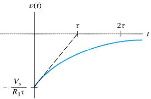
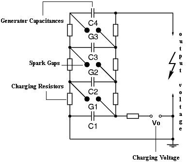

## Theory

Transient over-voltages due to lightning and switching action cause steep build up of voltage on transmission lines and other electrical power apparatus. Experimental investigations show that these waves have a rise time of 0.5 to 10µs and decay time to 50% of the peak value of the order of 30 to 200µs. The wave-shapes are arbitrary, but mostly unidirectional. It is shown that lightning over-voltages can be represented as double exponential waves defined by the equation:

V=Vo [exp (-at)-exp (-βt)] 

where a and β are constants of inverse microsecond values. The equation (1) represents a unidirectional wave which usually has a rapid rise to the peak value and slowly falls to zero value. The standard wave-shape is given in figure below.

The impulse waves are specified by defining their rise or front time, fall (or tail time) to 50% peak value, and the value of the peak voltage. Thus 1.2/50µs, 1000 kV wave represents an impulse voltage wave with a front time of 1.2µs, fall (or tail) time to 50% peak value of 50µs and a peak value of 1000 kV. When impulse wave-shapes are recorded, the initial portion of the wave may not be clearly defined or sometimes may be missing. Hence, front and tail times are to be redefined. Referring to the wave shape in figure 1, the peak value A is fixed and referred to as 100% value. The point corresponding to 10% and 90% of the peak values are located on the front portion (points C and D).O' is taken as the virtual origin. 1.25 times the interval between times t1 and t2 corresponding to points C and D is defined as the front time, i.e. 1.25(O't1-O't2). The point E is located on the wave tail corresponding to 50% of the peak value, and it is t4. O't4 is defined as fall or tail time. In case, C is not clear or missing from the wave shape record, the point corresponding to 30% of the peak value is taken on the time axis and then the wave front time in that case will be 1.67 times in place of 1.25. The tolerances that can be allowed on the front and tail times are respectively ± 30% and ± 20%.The tolerance allowed on the peak value is ± 3%.

#### List of abbreviations and symbols

Abbreviation | Symbol
:--|:--|
Cg | Generator Capacitance (µF)
Vg | Charging Voltage (kV)
Lf | Inductance of Front Resistor (µH)
Rf | Front Resistor (Ω)
Tf | Front Time (µs)
IVG | Impulse Voltage Generator
Cl | Load Capacitance (µF)
Ll | Load Inductance (µH)
Vl | Output impulse Voltage (kV)
Vp | Peak Voltage (kV)
Lt | Inductance of Tail Resistor (µH)
Rt | Tail Resistor (Ω)
Tt | Tail Time (µs)
Tr | Time range (µs)
Tp | Time to Peak value (µs)
VHVL | Virtual High Voltage Laboratory

#### Transients

When a power device is abruptly switched on or turned off, trapped energy in the circuit stray inductance is dissipated in the switching device, causing a voltage overshoot across the device termed as transient or over voltage. The magnitude of this transient voltage is proportional to the amount of stray inductance and the rate of fall of turn-off current. The time-varying currents and voltages resulting from the sudden application of sources are called transients.

#### RC Transients

The capacitor C is initially charged with charging voltage Vi. When switch is closed at t=0+, the capacitor gets discharged through resistor R, with output voltage, as shown in Fig. 1.

Fig:1: Typical RC circuit

A capacitor C discharge through resistance R, hence, gives the output equation (2)

vc(t)=Vi -t/RC

Fig:2: Typical waveform for capacitor voltage vs time

vc is the voltage across the capacitor, Vi is the initial charging voltage for the capacitor, R is the resistance and C is the capacitance of electrical circuit,Fig.1.

The time interval τ (= RC) is called as the time constant of the circuit. The voltage vs time for the circuit, is shown in Fig. 2. This is the time for decay to 36.8 % of the initial value.

Fig:3: Typical RC circuit

Another arrangement to study the transient is shown in Fig. 3. The circuit itself has a dc source, which charges the capacitor C through a resistor R and gives the output voltage vc(t). The time interval τ (= RC) is called as the time constant of the circuit. This is the time for decay to 63.2% of the initial value. The voltage vs time for the circuit, is shown in Fig. 4.

Fig:4: Charging transient of RC circuit

#### RL Transients

For DC circuit analysis, the voltage and current source excitation is constant, so C and L are neglected. The circuit is assumed to be as it is since time t= -∞ to ∞. In practice, no excitation is constant from t= -∞ to ∞.
The input DC voltage Vs, which stores the energy in L through a resistor R and gives the output, as shown in Fig. 5.

Fig:5: Typical RL circuit

Vt(t) is the voltage across inductor. In eq. 4, it is noticed that in time L/R seconds, the voltage across the inductor reduces to 1/e of its original value and would go on decreasing by a further factor of 1/e in every L/R seconds thereafter.
Another arrangement to study the transient is shown in Fig. 7. Initial current at t=0 is present through the inductor, at t=0+,

Fig:6: Typical waveforms i(t) vs t and v(t) vs t of RL circuit

Fig:7: Typical RL circuit

For (R2 → ∞ ) discharge will be immediate hence, switching off causes spark at switch. The respective current and voltage waveforms vs time are shown in Fig. 8. The time interval τ (= L/R) is called as the time constant of the circuit.

Fig:8: Typical waveforms i (t) vs t and v (t) vs t of RL circuit

#### RC vs RL

In a resistor-capacitor charging circuit, capacitor voltage from zero to full source voltage, while current goes from maximum to a zero, both variables changing most rapidly at first, approaching their final values slower and slower as time goes on. In a resistor-inductor "charging" circuit, inductor current goes from zero to full value while voltage goes from maximum to a zero, both variables changing most rapidly at first, approaching their final values slower and slower as time goes on.  

Resistor-capacitor circuits respond quicker with low resistance and slower with high resistance; resistor-inductor circuits are just the opposite, responding quicker with high resistance and slower with low resistance. While capacitive circuits seem to present no intuitive trouble for the new student, inductive circuits tend to make less sense.  

A capacitor's electrostatic energy storage manifests itself in the tendency to maintain a constant voltage across the terminals. An inductor's electromagnetic energy storage manifests itself in the tendency to maintain a constant current through it.  

In either case, heat dissipated by the resistor constitutes energy leaving the circuit, and as a consequence the reactive component loses its store of energy over time, resulting in a measurable decrease of either voltage (capacitor) or current (inductor) expressed on the graphs. The more power dissipated by the resistor, the faster this discharging action will occur, because power is by definition the rate of energy transfer over time.  

Therefore, a transient circuit's time constant will be dependent upon the resistance of the circuit. Of course, it is also dependent upon the size (storage capacity) of the reactive component. A circuit's time constant will be less (faster discharging rate) if the resistance value is such that it maximizes power dissipation (rate of energy transfer into heat). For a capacitive circuit where stored energy manifests itself in the form of a voltage, this means the resistor must have a low resistance value so as to maximize current for any given amount of voltage. For an inductive circuit where stored energy manifests itself in the form of a current, this means the resistor must have a high resistance value so as to maximize voltage drop for any given amount of current.  

As already shown, to DC a capacitor acts as an open circuit and inductor acts as a short circuit, in order to generate a transient a capacitor needs to be discharged of its voltage and an inductor needs an interruption in current. While it is easy to close a switch to discharge a charged capacitor but in trying to interrupt DC current through an Inductor is quiet difficult.  

#### Single stage circuit-IVG

Fig:9: Equivalent circuit of a single stage IVG

The one-stage equivalent, of an impulse voltage circuit with a capacitive load is shown in Fig. 9. Resistances, which are used in Marx circuit, are non inductive. All resistances have some small internal inductances, which leads to the inefficient outputs. The inductance Lf represents the loop inductance offered by the front resistance that is responsible for the overshoot of lightning impulse (LI) which must be limited to below 5%. Similarly Lt is the inductance offered by the tail resistance of the impulse circuit. These inductances are incorporated in the equivalent circuit to give the VHVL a more realistic feel.

#### Single stage circuit-IVG

As mentioned earlier in IVG Introduction (http://10.9.1.224:85/), impulse voltages are represented as a sum of two exponentials. A double exponential wave shape can be generated by having a circuit with energy storage elements with independent control for rising portion and falling portion of the wave. These circuit elements can either be capacitors or inductors.  

Since inductors of large ratings are difficult to manufacture owing to their large size and high currents involved, hence a speedy suitable discharge circuit consisting of capacitors could be preferred.  

Fig:10: Three stage Marx Generator Circuit

#### Marx Circuit

In 1916, Marx proposed a circuit which can be used for generating high impulse voltages. The basic principle of operation of the Marx circuit is that the capacitors are charged in parallel and discharged in series by triggering a switch. Hence, a very high voltage can be obtained when the impulse generator discharges.  

As shown in Fig. 10, the front resistors and the discharge resistors are distributed along each stage. Sphere gaps are used as switches to connect the parallely charged capacitors in series. A high voltage dc source is used to charge the capacitors in parallel. The charging current is limited by a large charging resistance which is typically of the order of a few kilo ohms. On firing (or triggering) the lowest sphere gap, stages 1 and 2 get connected in series. Hence, the individual voltages across the stages 1 and 2 appear as a sum across the next gap, thereby triggering it and thus connecting all the stages in series. Hence, an impulse voltage is obtained across the load capacitance.  

A definite advantage that the Marx circuit has over other impulse generating circuits is that very high impulse voltages can be generated using components rated for relatively low voltages. Impulses of different front times can be conveniently obtained by varying series resistor. The sphere-gap can be triggered at a predetermined voltage by adjusting the spacing between the spark gaps. Hence, it acts as a controlled switch. The steepness of the impulse voltage generated is affected by the inherent inductance of the Marx generator. This inductance is due to the charging loop comprising of the generator capacitor, front resistor and load capacitor. This cannot be reduced below a certain minimum value because of the restrictions placed on the minimum dimensions due to the high voltage ratings involved in the circuit.  

